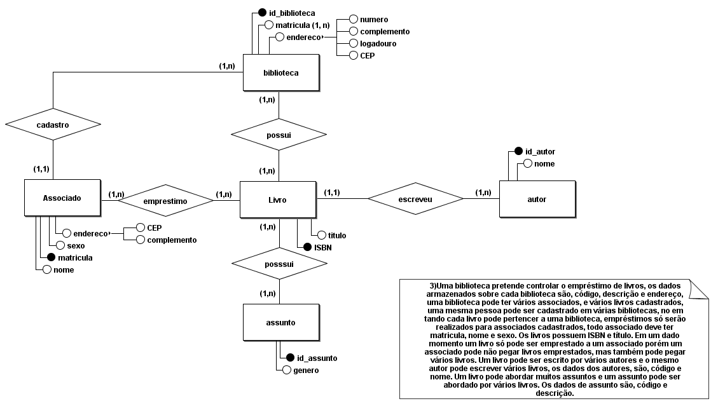

## Biblioteca e Associados

Uma biblioteca pretende controlar o empréstimo de livros, os dados
armazenados sobre cada biblioteca são, código, descrição e endereço,
uma biblioteca pode ter vários associados, e vários livros cadastrados,
uma mesma pessoa pode ser cadastrado em várias bibliotecas, no em
tando cada livro pode pertencer a uma biblioteca, empréstimos só serão
realizados para associados cadastrados, todo associado deve ter
matricula, nome e sexo. Os livros possuem ISBN e título. Em um dado
momento um livro só pode ser emprestado a um associado porém um
associado pode não pegar livros emprestados, mas também pode pegar
vários livros. Um livro pode ser escrito por vários autores e o mesmo
autor pode escrever vários livros, os dados dos autores, são, código e
nome. Um livro pode abordar muitos assuntos e um assunto pode ser
abordado por vários livros. Os dados de assunto são, código e
descrição.

## Modelagem

[Voltar](../../README.md)

